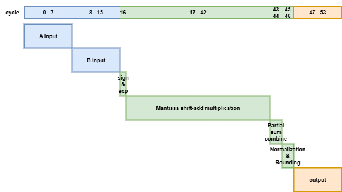
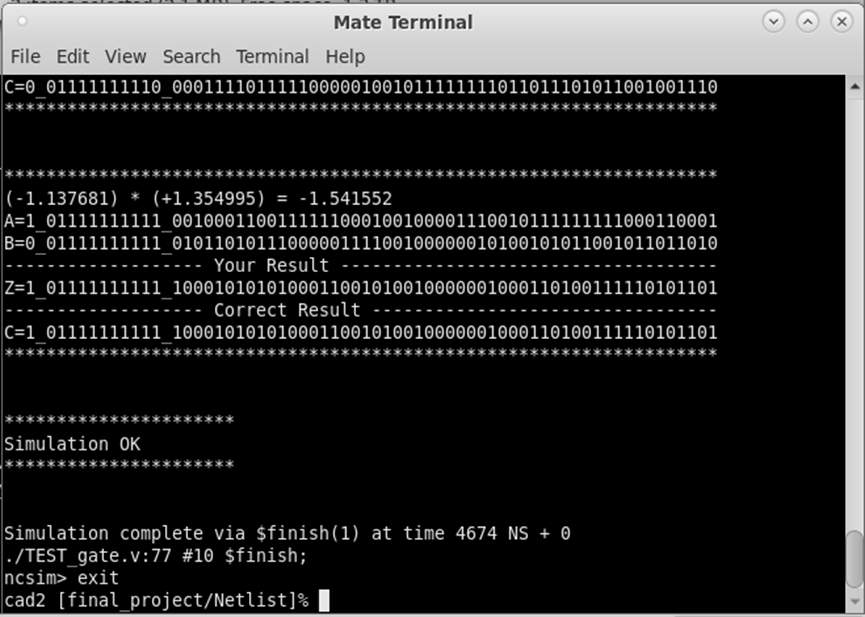
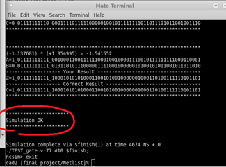
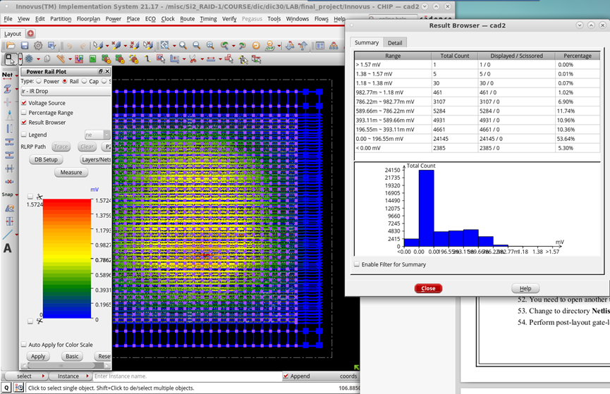

# IEEE Standard 754 Floating Point Multiplier

IEEE 754 double precision floating point multiplier implemented in synthesizable
Verilog HDL.

This project implements a 64-bit floating point multiplier using a
counter-based multi-cycle sequential architecture with shift-add mantissa
multiplication.

Supported flow:

* RTL simulation
* Randomized RTL verification
* Gate-level simulation
* Synthesis
* APR implementation
* Post-layout verification
* IR drop / power rail analysis


# Table of Contents

* [Repository Layout](#repository-layout)

* [Architecture](#architecture)

  * [Floating Point Multiplier Architecture](#floating-point-multiplier-architecture)
  * [System Organization](#system-organization)
  * [I/O Interface](#io-interface)

* [Core Design](#core-design)

  * [IEEE 754 Double Precision Format](#ieee-754-double-precision-format)
  * [Design Assumption](#design-assumption)
  * [Sign Processing](#sign-processing)
  * [Exponent Calculation](#exponent-calculation)
  * [Mantissa Multiplication](#mantissa-multiplication)
  * [Output Range Handling](#output-range-handling)

* [Verification & Result](#verification--result)

  * [RTL Simulation](#rtl-simulation)
  * [Randomized Testbench](#randomized-testbench)
  * [Gate-Level Simulation](#gate-level-simulation)
  * [Timing Constraint](#timing-constraint)
  * [Power Rail Analysis](#power-rail-analysis)

* [Result Summary](#result-summary)


# Repository Layout

```text
IEEE-754_FP_Multiplier/
├── rtl/
│   └── FP_MUL.v                # Floating point multiplier RTL
│
├── tb/
│   └── tb_FP_MUL.v             # RTL testbench
│
├── img/
│   ├── FP_MUL_architecture.png
│   ├── RTL_simulation.png
│   ├── Netlist_simulation.png
│   └── CHIP_power_analysis.png
│
├── README.md
└── LICENSE
```


# Architecture

## Floating Point Multiplier Architecture



The design adopts a counter-based multi-cycle datapath architecture.

<table>
  <tr>
    <th align="center">Cycle</th>
    <th align="center">Stage</th>
    <th align="left">Description</th>
  </tr>
  <tr>
    <td align="center">0 - 15</td>
    <td align="center">Input</td>
    <td align="left">Serial input transmission</td>
  </tr>
  <tr>
    <td align="center">16</td>
    <td align="center" rowspan="3">Operation</td>
    <td align="left">Sign and exponent processing</td>
  </tr>
  <tr>
    <td align="center">17 - 42</td>
    <td align="left">Mantissa shift-add multiplication</td>
  </tr>
  <tr>
    <td align="center">43 - 46</td>
    <td align="left">Partial sum combine, normalization, and rounding</td>
  </tr>
  <tr>
    <td align="center">47 - 54</td>
    <td align="center">Output</td>
    <td align="left">Serial output transmission</td>
  </tr>
</table>


## System Organization

Main components:

* Serial input interface
* Input byte buffering
* Sign processing
* Exponent calculation
* Shift-add mantissa multiplication
* Normalization and rounding
* Output range handling
* Serial output interface


## I/O Interface

Top module:

```verilog
module FP_MUL(CLK, RESET, ENABLE, DATA_IN, DATA_OUT, READY);
```

| Port | Direction | Width | Description |
| --- | --- | --- | --- |
| `CLK` | Input | 1 | Clock signal |
| `RESET` | Input | 1 | Active-high synchronous reset |
| `ENABLE` | Input | 1 | Input byte valid signal |
| `DATA_IN` | Input | 8 | Serial input byte |
| `DATA_OUT` | Output | 8 | Serial output byte |
| `READY` | Output | 1 | Output byte valid signal |

Input data order:

* Operand A is input in 8 clock cycles.
* Operand B is input in 8 clock cycles.
* Each operand is transmitted lower byte first.

Output data order:

* Result Z is output in 8 clock cycles.
* The output result is transmitted lower byte first.
* `READY` stays high during the 8 output cycles.


# Core Design

## IEEE 754 Double Precision Format

| Field | Bits |
| --- | --- |
| Sign | 1 |
| Exponent | 11 |
| Fraction | 52 |

Bias value:

```text
Bias = 1023
```


## Design Assumption

The RTL assumes both input operands are legal finite normal double precision
numbers.

The input operands are not decoded as NaN or infinity. Under this legal-input
assumption, the output may still become a special value when the result exponent
is outside the normal finite range.

| Output condition | Result |
| --- | --- |
| Normal finite result | IEEE 754 normal result |
| Overflow | Signed infinity |
| Underflow | Signed zero |


## Sign Processing

The result sign bit is generated using XOR operation.

```verilog
sign <= total_A[63] ^ total_B[63];
```


## Exponent Calculation

Exponent calculation includes exponent addition and bias correction.

```verilog
exp <= (total_A[62:52] + total_B[62:52]) + 11'b100_0000_0010;
```

The output range check uses an extended signed exponent path.

```verilog
exp_wide = exp_a + exp_b - 1023 + normalize_adjust;
```


## Mantissa Multiplication

The mantissa multiplication is implemented with shift-add accumulation across
multiple clock cycles.

```verilog
temp1 <= temp1 + (frac_partial_A << n);
temp2 <= temp2 + (frac_partial_A << n);
```

The sequential implementation helps reduce combinational complexity and shorten
critical path delay.

Features:

* Multi-cycle shift-add operation
* Reduced hardware complexity
* Improved synthesis timing
* Easier timing closure


## Output Range Handling

For legal finite normal inputs, the result exponent is checked before output.

* If the final exponent is greater than or equal to 2047, the output becomes
  signed infinity.
* If the final exponent is less than or equal to 0, the output becomes signed
  zero.
* Otherwise, the normalized and rounded finite result is sent to `DATA_OUT`.

The range handling logic is written in synthesizable Verilog.


# Verification & Result

## RTL Simulation



RTL simulation passed functional verification for legal finite normal inputs.


## Randomized Testbench

The randomized testbench is located in:

```text
tb/tb_FP_MUL.v
```

The testbench includes:

* Directed normal-number tests
* Legal-input output overflow tests
* Legal-input output underflow tests
* 100 randomized normal-number tests by default
* `READY` pulse length checking
* Lower-byte-first input and output checking

Run RTL simulation with Icarus Verilog:

```powershell
iverilog -g2012 -Wall -o tb\tb_FP_MUL.vvp rtl\FP_MUL.v tb\tb_FP_MUL.v
vvp tb\tb_FP_MUL.vvp
```

The random seed and random test count can be changed with plusargs.

```powershell
vvp tb\tb_FP_MUL.vvp +SEED=1234 +RANDOM_COUNT=1000
```

Latest randomized RTL result:

```text
Directed normal tests: PASS
Output range tests with legal inputs: PASS
Random normal tests: 100 passed, 0 failed
Summary: 108 passed, 0 failed
```


## Gate-Level Simulation



Gate-level simulation passed post-synthesis verification.


## Timing Constraint

```text
Target Clock Period : 0.4 ns
Target Frequency    : 2.5 GHz
```

The design was synthesized using SDC timing constraints.


## Power Rail Analysis



IR drop and power rail analysis were performed after APR implementation.


# Result Summary

| Verification | Status |
| --- | --- |
| RTL syntax check | PASS |
| RTL directed normal tests | PASS |
| RTL output range tests | PASS |
| RTL randomized normal tests | PASS |
| Gate-level simulation | PASS |
| Functional verification | PASS |
| IR drop check | PASS |
| DRC | PASS |
| LVS | MATCHED |
